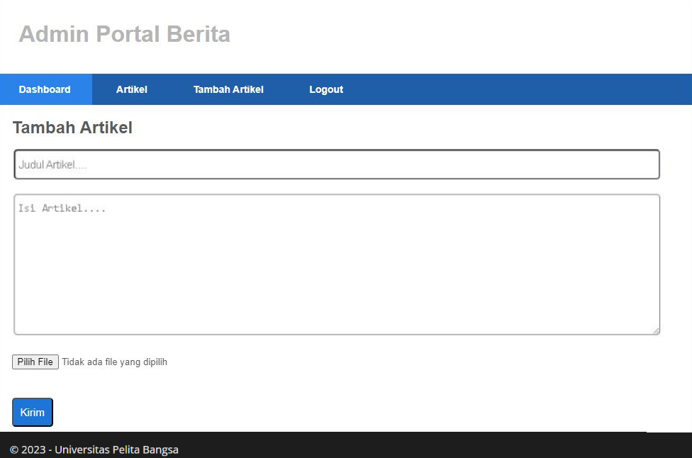

# Tugas Pemrograman Web 2
# Praktikum 11
## Profile
<body>
    <table border="1">
        <tr>
            <th> Nama</th>
            <th>NIM</th>
            <th>Kelas</th>
        </tr>
        <tr>
            <td>Rezza Fauzi</td>
            <td>312110133</td>
            <td>TI.21.A.1</td>
        </tr>
    </table>
</body>

## Intructions
- Melanjutkan praktikum sebelumnya pada repository dengan nama Lab10Web.
- Kerjakan semua latihan yang diberikan sesuai urutannya.
- Screenshot setiap perubahannya.
- Update file README.md dan tuliskan penjelasan dari setiap langkah praktikum beserta screenshotnya.
- Commit hasilnya pada repository masing-masing.
- Kirim URL repository pada e-learning ecampus

***Buka kembali Controller Artikel pada project sebelumnya, sesuaikan kode pada method add seperti berikut.***

```php
public function add()
{
// validasi data.
$validation = \Config\Services::validation();
$validation->setRules(['judul' => 'required']);
$isDataValid = $validation->withRequest($this->request)->run();
if ($isDataValid)
{
$file = $this->request->getFile('gambar');
$file->move(ROOTPATH . 'public/gambar');
$artikel = new ArtikelModel();
$artikel->insert([
'judul' => $this->request->getPost('judul'),
'isi' => $this->request->getPost('isi'),
'slug' => url_title($this->request->getPost('judul')),
'gambar' => $file->getName(),
]);
return redirect('admin/artikel');
}
$title = "Tambah Artikel";
return view('artikel/form_add', compact('title'));
}
```

***Kemudian pada file views/artikel/form_add.php tambahkan field input file seperti berikut.***

```html
<p>
<input type="file" name="gambar">
</p>
```

***Sesuaikan tag form dengan menambahkan ecrypt type seperti berikut.***

```html
<form action="" method="post" enctype="multipart/form-data">
```

## Ujicoba file upload dengan mengakses menu tambah artikel.



## Done
